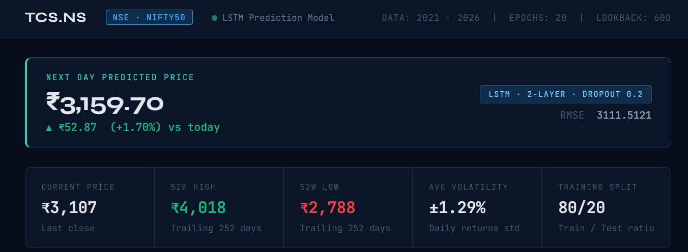
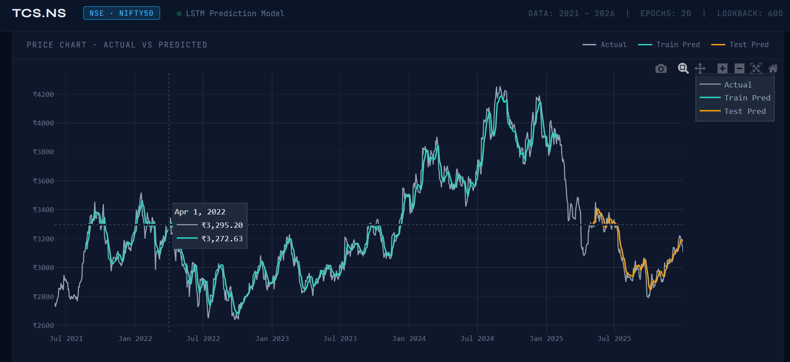

 📈 Stock Price Prediction using Deep Learning (LSTM)

>> Can a Neural Network Learn the Language of the Stock Market?

Every trading day leaves behind a trail of data — prices rise, fall, consolidate, and react to countless market events. While no model can perfectly predict the future, patterns hidden within historical data can often reveal valuable insights.

This project explores whether a Long Short-Term Memory (LSTM) Neural Network can learn those patterns and forecast future stock prices.

Using historical stock market data from TCS (Tata Consultancy Services), I built an end-to-end deep learning pipeline that transforms raw financial data into actionable predictions and visual insights through an interactive dashboard.

---

 🎯 Project Goal

The objective of this project was not simply to train a machine learning model, but to build a complete prediction system capable of:

* Collecting real-world stock market data
* Engineering meaningful financial indicators
* Learning temporal market patterns
* Predicting future stock prices
* Visualizing predictions through an interactive dashboard

---

🔍 Data Collection

Historical stock data was collected directly from Yahoo Finance using the yFinance API.

The dataset includes:

* Open Price
* High Price
* Low Price
* Close Price
* Trading Volume

To provide the model with richer market context, additional technical indicators were generated:

# MA50 (50-Day Moving Average)

Represents medium-term market trends.

### MA100 (100-Day Moving Average)

Captures longer-term price direction.

# Daily Returns

Measures percentage price changes between consecutive trading sessions and helps quantify volatility.

---

 >. Why LSTM?

Traditional machine learning algorithms struggle with sequential data because they do not naturally understand time dependencies.

Stock prices are inherently time-series data where previous observations influence future movements.

To address this challenge, I implemented a Long Short-Term Memory (LSTM) network, a specialized type of Recurrent Neural Network (RNN) designed to:

* Remember long-term patterns
* Learn market trends over time
* Capture temporal dependencies
* Reduce information loss compared to traditional neural networks

---

>. ⚙️ Model Architecture

The prediction engine consists of:

* LSTM Layer (50 Units)
* Dropout Layer (20%)
* LSTM Layer (50 Units)
* Dropout Layer (20%)
* Dense Output Layer

Training Configuration:

* Optimizer: Adam
* Loss Function: Mean Squared Error
* Lookback Window: 60 Trading Days
* Training Split: 80%
* Testing Split: 20%

The model learns from the previous 60 trading sessions to forecast the next closing price.

---

# 📊 Interactive Visualization Dashboard

A custom dashboard was developed using Plotly and HTML to provide a professional visualization experience.

Dashboard Features:

* Actual vs Predicted Price Comparison
* Next-Day Stock Forecast
* 52-Week High and Low Analysis
* Market Volatility Metrics
* Interactive Hover-Based Exploration
* Dark-Themed Trading Interface

The dashboard transforms raw predictions into a more intuitive and user-friendly analytical tool.

## Dashboard preview 

## Prediction Graph

---

# 📈 Results

After training, the model successfully learned market behavior patterns from historical data and generated future price forecasts.

Performance evaluation was conducted using:

* Root Mean Squared Error (RMSE)
* Actual vs Predicted Price Analysis
* Trend Consistency Verification

The model demonstrated the ability to follow broader market trends while maintaining reasonable prediction accuracy.

---

# 🚀 Key Learnings

Through this project, I gained practical experience in:

* Time-Series Forecasting
* Deep Learning with TensorFlow/Keras
* Financial Data Engineering
* Feature Generation
* Model Evaluation
* Interactive Data Visualization
* End-to-End Machine Learning Workflows

More importantly, this project highlighted a critical lesson:

> Building a machine learning model is only part of the journey. Transforming data into meaningful insights through engineering, experimentation, and visualization is where the real value is created.

---

🛠️ Tech Stack ( most imp)

Python • TensorFlow • Keras • NumPy • Pandas • Scikit-Learn • Plotly • Matplotlib • Yahoo Finance API

---

## 🔮 Future Enhancements

Future versions of this project may include:

* Real-Time Market Data Streaming
* Multi-Stock Prediction Support
* Sentiment Analysis from Financial News
* Advanced Technical Indicators (RSI, MACD)
* Streamlit-Based Web Deployment
* Portfolio Optimization Integration

---

## 👨‍💻 Author

Sagar

Deep Learning | Data Science | Financial Analytics | Machine Learning
